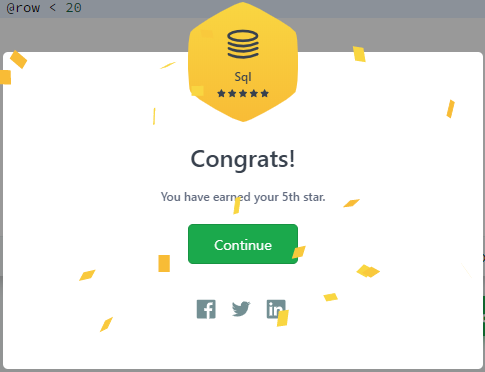
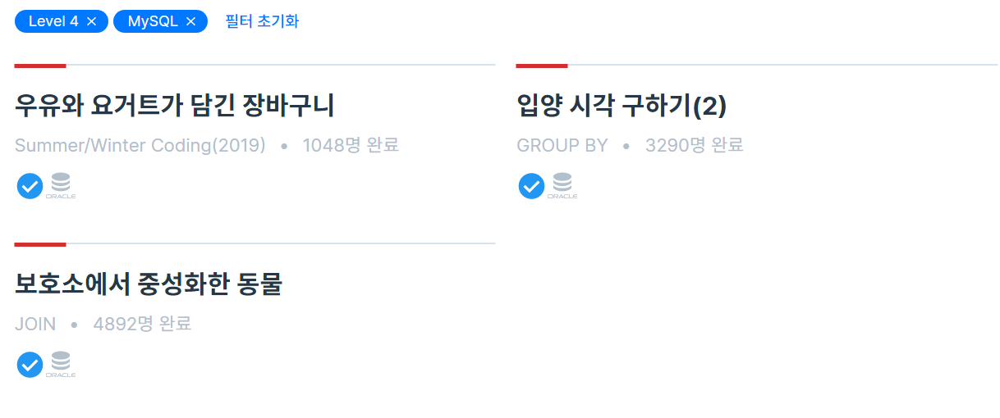

# To_be_SQLmaster
* SQL쿼리 작성 연습하기
  * [HackerRank](https://www.hackerrank.com/domains/sql?filters%5Bstatus%5D%5B%5D=unsolved&badge_type=sql) - 진행중
   * SQL 레벨 5 뱃지 획득!!!
   * 
  * [Programmers](https://programmers.co.kr/learn/challenges?tab=sql_practice_kit) - 1문제 빼고 완료 (20/02/06)

- - - -
## HackerRank 공부 요약

#### 1) SELECT의 기본적인 활용을 연습하기
* 난이도 자체는 쉬웠음
* 알게 된 것
  * SUBSTR
    * 엑셀에서 LEFT, RIGHT, MID 정말 많이 쓰는데 SQL에선 SUBSTR이 인덱스 참조엔 종결인듯
    * 특히 끝에서부터 찾는 SUBSTR(col,**-1**,n) 은 파이썬과 동일해서 편했음
  * 와일드카드
    * SQL에서 와일드카드론 %를 사용
    * (TMI) 엑셀에선 와일드카드로 * 사용 (0,?등 도 있지만 주로 *를 썼음)
* 그 외
  * 나머지 구문들은 다 아는 내용이어서 따로 구글링한 것은 없었음
  * 그래도 역시 쿼리 날려보는건 다다익선
  
#### 2) Aggregation! 
* ROUND(col, n)
  * ROUND(col, n, 1) 은 n 이후 !
  * 반올림할 때 사용하는 쿼리문
  * EXCEL과 함수가 동일해서 바로 이해됨
  * 하지만 있다는걸 모르면 그건 모르는거다! *메타인지!*

* SELECT에서 계산
  * SELECT (MAX(col1) - MIN(col1)) 이런거 가능
* CEIL()
  * 올림 함수
  * 반대는 FLOOR()
* ABS()
  * 절대값 구하는 함수
  * 이것 또한 EXCEL과 동일
* POWER(val, n)
  * val의 n제곱
* SQRT(n)
  * n의 제곱근  

- - - -
## Programmers 공부 요약
* ~~몇 문제 빼고는 막히지 않고 한 번에 풀었음~~
* 모든 문제 클리어
  * 못풀고있던 LV.4도 모두 풀었다.
    * inner join, 변수 선언 공부해서 풀어버림.
  * 
* 후기
  * SQL 문제들을 풀어보면 SELECT에서 WEHRE, HAVING, ORDER 관련 문제가 많음
    * 간혹 JOIN 나오는 정도?
  * 실무에서는 어느정도의 쿼리를 자주 사용하는지 궁금함.
